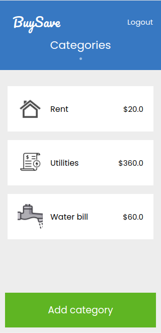

# Budget App


> A mobile web application that lets you manage and keep track of transactions.



A mobile web application where you can manage your budget: you have a list of transactions associated with a category, so that you can see how much money you spent and on what.

## Built With

- Ruby on Rails
- PostgreSQL

## Live Link

[Heroku](https://transaction-a.herokuapp.com/)

## Demo

[Demo](https://www.loom.com/share/f0dd8583e58b412c9c722f79153efaf9)

## Getting Started

To get a local copy up and running follow these simple example steps.

### Prerequisites

- [Ruby](https://www.ruby-lang.org/en/)
- [Rails](https://gorails.com/)

### Setup

- Make sure you have Ruby on Rails set up properly on your computer
- Clone or download this repo on your machine with `git clone git@github.com:Leandro-Barretoo/TransApp.git`
- Enter project directory with `cd TransApp`

### Install

```sh
bundle install or bundle i
```

### Database

```sh
# Create the database
rails db:create

## Apply migration
rails db:migrate
```

### Run

```sh
rails s
```

### Test

```sh
rspec
```

## Authors

👤 **Leandro Barreto**

- GitHub: [@Leandro-Barretoo](https://github.com/Leandro-Barretoo)
- LinkedIn: [Leandro Barreto](https://www.linkedin.com/in/leandroobarreto/)

## 🤝 Contributing

Contributions, issues, and feature requests are welcome!

Feel free to check the [issues page](../../issues/).

## Show your support

Give a ⭐️ if you like this project!

## Acknowledgments

- Microverse
- Original design idea by Gregoire Vella on [Behance](https://www.behance.net/gregoirevella).

## License

[MIT](./LICENSE)
